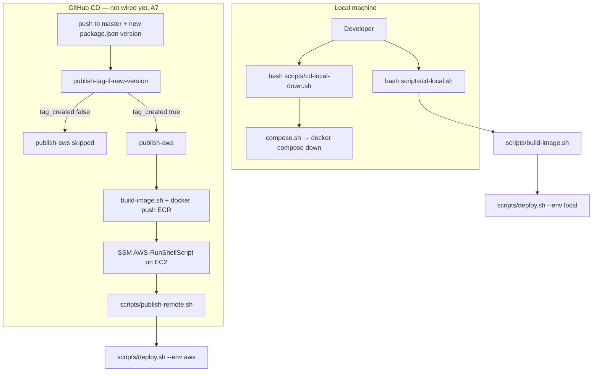
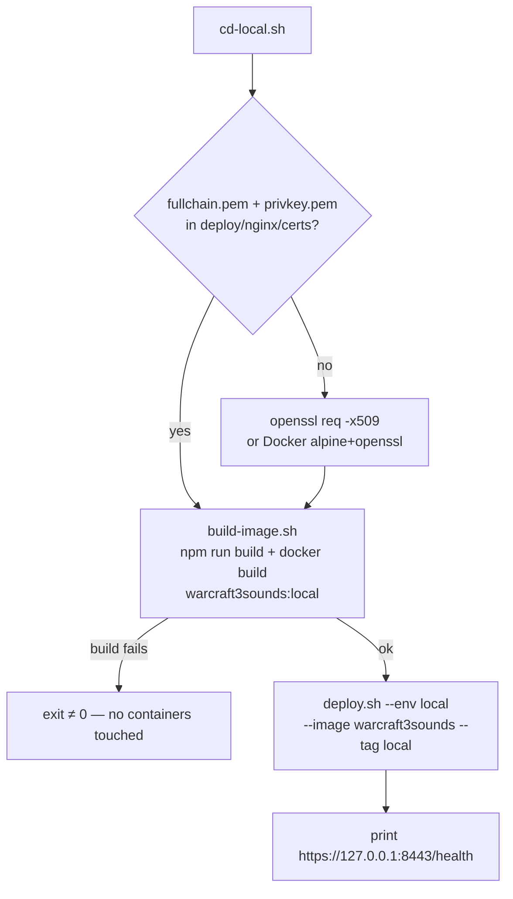
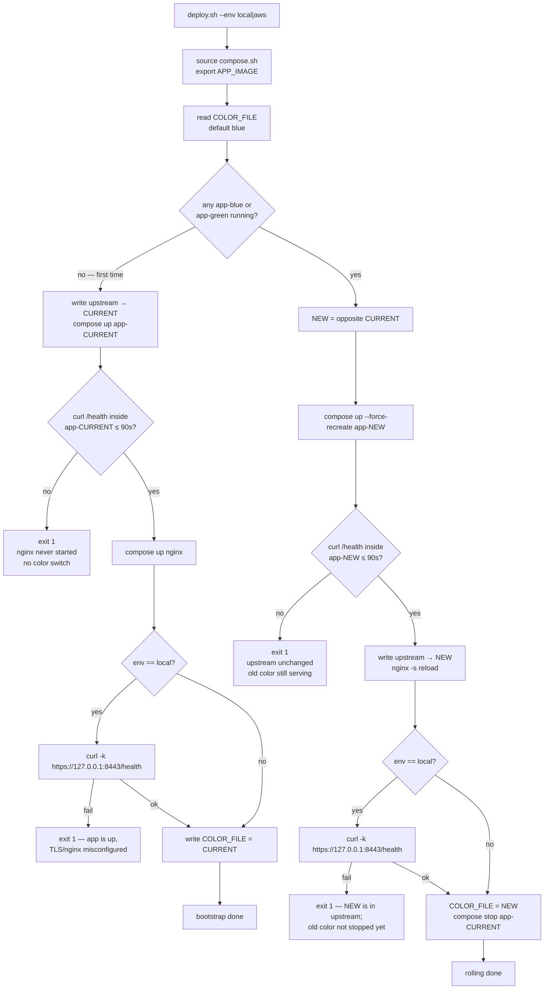
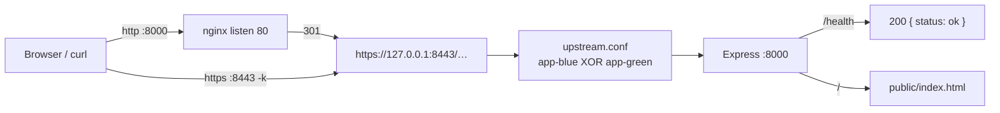

# Deploy documentation (local + AWS)

How a new version is built, switched in (blue/green), and served over TLS. Local and production share the **same** rolling script and nginx TLS config. Only ports, certificate paths, and the image name change.

Related: implementation plan in [PLAN.md](./PLAN.md), console steps in [TUTO.md](./TUTO.md).

---

## Why a local deploy exists

Local deploy does **not** emulate AWS (no ECR, IAM, or SSM). It replays the **same** sequence the CD will run on the EC2: Docker image → nginx → one active color → `GET /health` → HTTPS.

That is how a 502, a bad switch, or a broken nginx cert is caught **before** the first `publish-aws`. You can:

- keep `GET /` up while the idle color starts;
- confirm a failing `/health` does **not** take the old color down;
- exercise TLS at `https://127.0.0.1:8443` with a gitignored self-signed cert.

---

## Runtime (who talks to whom)

nginx terminates TLS. Express / PM2 stay on plain HTTP `:8000` on the Docker network. Only **one** color is in `upstream.conf`.

```text
  Client
    │
    ├─ :80  ──► nginx  ──► 301 to HTTPS   (+ ACME on AWS)
    │
    └─ :443 ─► nginx TLS ──► upstream (blue XOR green) :8000
                    │
                 ┌──┴──────────────────────────────┐
                 ▼                                 ▼
        app-blue :8000                    app-green :8000
```

| | Local (`--env local`) | AWS (`--env aws`) |
| --- | --- | --- |
| TLS terminator | nginx `listen 443 ssl` | same |
| Host ports | **8000→80**, **8443→443** | **80→80**, **443→443** |
| HTTP | redirect to `https://127.0.0.1:8443` | redirect to `https://$host` + ACME |
| Certificate | self-signed under `deploy/nginx/certs/` (gitignored) | Let’s Encrypt under `/opt/warcraft3sounds/certs` |
| Image | `warcraft3sounds:local` | `${ECR}/warcraft3sounds:<version>` |

Overlays are **never** loaded together: `compose.sh` always uses the base file plus **one** overlay.

---

## Compose files

Docker Compose merges YAML. The base file says *what* runs; the overlay says *where it is published* and *which image*.

| File | Role |
| --- | --- |
| [`deploy/docker-compose.yml`](./deploy/docker-compose.yml) | Three services: `nginx`, `app-blue`, `app-green`. App `/health` checks, `stop_grace_period` 20s (time for `SIGTERM`). **No public app ports** — Node is only reachable on the Docker network. |
| [`deploy/docker-compose.local.yml`](./deploy/docker-compose.local.yml) | Host ports 8000/8443, cert bind `deploy/nginx/certs/`, image `warcraft3sounds:local`, HTTP redirect to `:8443`. |
| [`deploy/docker-compose.aws.yml`](./deploy/docker-compose.aws.yml) | Host ports 80/443, certs from `${CERTS_HOST_DIR}`, ACME webroot, image `${APP_IMAGE}`. |

Two identical app services exist so the **new** color can start while the **old** one still serves traffic.

---

## nginx files

| File | Role |
| --- | --- |
| [`deploy/nginx/nginx.conf`](./deploy/nginx/nginx.conf) | Shared: `listen 443 ssl`, `proxy_pass` to `upstream backend`. Same locally and on AWS. |
| [`deploy/nginx/upstream.conf`](./deploy/nginx/upstream.conf) | One line, e.g. `server app-blue:8000;`. **Rewritten by `deploy.sh`**, then `nginx -s reload` (keep-alive connections stay up). |
| [`deploy/nginx/http-local.conf`](./deploy/nginx/http-local.conf) | `listen 80` → `301` to `https://127.0.0.1:8443…` (host TLS is not on 443). |
| [`deploy/nginx/http-aws.conf`](./deploy/nginx/http-aws.conf) | `listen 80` → `301` to `https://$host…` **and** `/.well-known/acme-challenge/` for Let’s Encrypt. |

Each overlay mounts its HTTP snippet as `/etc/nginx/http-listen.conf`. `nginx.conf` includes that path, so there is a single `listen 80` block per environment.

---

## Shell scripts (who calls whom)

| Script | Role | Why it is a separate file |
| --- | --- | --- |
| [`scripts/compose.sh`](./scripts/compose.sh) | Defines `compose()`: `docker compose -f base -f overlay`. | Avoids repeating the four flags. **Sourced**, not meant to be run alone. |
| [`scripts/build-image.sh`](./scripts/build-image.sh) | `npm run build` then `docker build -t name:tag`. | The Dockerfile copies **already built** `lib/cjs` and `public/dist`. GitHub CD will call the same script before `docker push`. |
| [`scripts/deploy.sh`](./scripts/deploy.sh) | Rolling core: read active color → start the other → poll `/health` **inside** the container → rewrite `upstream.conf` → reload nginx → local HTTPS `curl` → stop the old color. Failed `/health` → **abort**, no switch. First run = bootstrap (one color + nginx). | **One** path for local and AWS (`--env`, `--image`, `--tag`). |
| [`scripts/cd-local.sh`](./scripts/cd-local.sh) | Dev orchestrator: self-signed cert if missing + build `warcraft3sounds:local` + `deploy.sh --env local`. | You should not have to chain three commands by hand. |
| [`scripts/cd-local-down.sh`](./scripts/cd-local-down.sh) | `compose down`. | Stops nginx and both colors without deleting the image. |
| [`scripts/publish-remote.sh`](./scripts/publish-remote.sh) | EC2 orchestrator: ECR login, `docker pull`, `git checkout` the version tag, `deploy.sh --env aws`. | GitHub CD does not open SSH; it will send this script via SSM. Unused locally. Color state on AWS lives **outside** the git worktree (`/opt/warcraft3sounds/state/current-color`) so `git checkout --force` cannot wipe it. |

Local and AWS share `deploy.sh` and `nginx.conf`. Ports, cert paths, and the image name are the only differences.

---

## How to run it locally

Needs Docker Compose v2 and bash. Until the npm wrapper exists ([PLAN.md](./PLAN.md) A6):

```bash
bash ./scripts/cd-local.sh
```

Then:

```bash
curl -kfsS https://127.0.0.1:8443/health
# → {"status":"ok"}
```

A second run of `cd-local.sh` (after another image build) performs a **rolling** switch (blue ↔ green).

Stop:

```bash
bash ./scripts/cd-local-down.sh
```

---

## Flowcharts

### 1. Who starts the procedure



### 2. `cd-local.sh` route



### 3. `deploy.sh` — bootstrap vs rolling, and failures



Failure rule: **start-first**. A dead `/health` on the new color never rewrites `upstream.conf`, so users keep hitting the previous version.

### 4. HTTP path after a successful deploy (local)



On AWS the same graph uses ports 80/443 and a public Let’s Encrypt certificate (no `curl -k`).

---

## What is not in this deploy

- Warcraft sound files (not in git, not in the CD, not in Compose volumes).
- Environment files (`.env` is gitignored; no `env.example` in the repo).
- The Node `ssl` flag in `main.cts` (self-signed inside Express). TLS is nginx-only.
